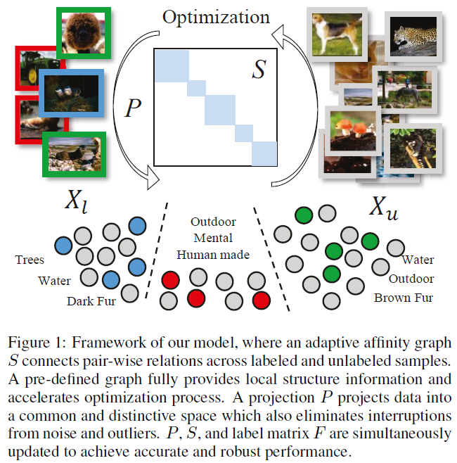

# AG2E Multi-label Learning
This repository contains code for our IJCAI 18 paper: [Adaptive Graph Guided Embedding for Multi-label Annotation](https://github.com/wanglichenxj/TSS_Action_Segmentation/blob/master/Presentation/TSS_Action_Segmentation_AAAI19_Lichen.pdf) (AG2E). AG2E utiluzes existing small scale multi-label datasets to recovery/annotate the large scale images in semi-supervised scenario. It designed an adaptive graph and a domain-invariable projection, which trained simultaneously to achieve the high performance.

<div align="center">
    
</div>

Multi-label annotation is challenging since a large amount of well-labeled training data are required to achieve promising performance. However, providing such data is expensive while unlabeled data are widely available. To this end, we propose a novel Adaptive Graph Guided Embedding (AG$^2$E) approach for multi-label annotation in a semi-supervised fashion, which utilizes limited labeled data associating with large-scale unlabeled data to facilitate learning performance. Specifically, a multi-label propagation scheme and an effective embedding are jointly learned to seek a latent space where unlabeled instances tend to be well assigned multiple labels. Furthermore, a locality structure regularizer is designed to preserve the intrinsic structure and enhance the multi-label annotation. We evaluate our model in both conventional multi-label learning and zero-shot learning scenario. Experimental results demonstrate that our approach outperforms other compared state-of-the-art methods.

## Running the code
The code is MATLAB code works in Ubuntu system. Windows system may need minor revision in the folder name. Direct diwnload the code and run AG2E_demo.m.

This repository contains two datasets, Weizmann dataset and Keck dataset, which are extracted HOG feature frame by frame. The features are 324-dimension feature metrix.

## Authors
Welcome to send us Emails if you have any questions about the code and our work :-)
* **Lichen Wang** [Website](https://sites.google.com/site/lichenwang123/)
* **Zhengming Ding** [Website](http://allanding.net/)
* **Yun Raymond Fu** [Website](http://www1.ece.neu.edu/~yunfu/)

## Papers
This code is corresponding to our AAAI 2018 paper below:
```
@inproceedings{AG2E_IJCAI18_Lichen,
  title={Adaptive Graph Guided Embedding for Multi-label Annotation.},
  author={Wang, Lichen and Ding, Zhengming and Fu, Yun},
  booktitle={IJCAI},
  pages={2798--2804},
  year={2018}
}
```
Please cite our paper if you like or use our work for your research, thank you very much!


